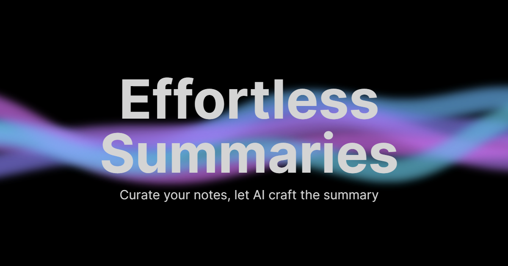

# Text Editor for Book Summarization

A web-based text editor designed to assist in the process of distilling information from books. This tool help users to efficiently organize raw book notes, create outlines, and generate personalized summaries using ChatGPT.

## Features

- **Raw Notes Editor:** Input and edit raw book notes.
- **Outline Editor:** Create structured outlines by selecting and transferring content from raw notes.
- **Summary Editor:** Review and edit summaries generated by ChatGPT.
- **ChatGPT Integration:** Generate a summary with the click of a button.
- **Save and Export:** Save drafts for future sessions and export summaries as text files.

## Usage

1. Input raw book notes.
2. Use the editor to create an outline by bolding key phrases.
3. Click the "Generate Summary" button to obtain a personalized summary from ChatGPT.
4. Review and edit the generated summary in the Summary Editor.

## Contributing

We welcome contributions! If you have ideas for improvements, feel free to open an issue or submit a pull request.

## License

This project is licensed under the [MIT License](LICENSE.md).
